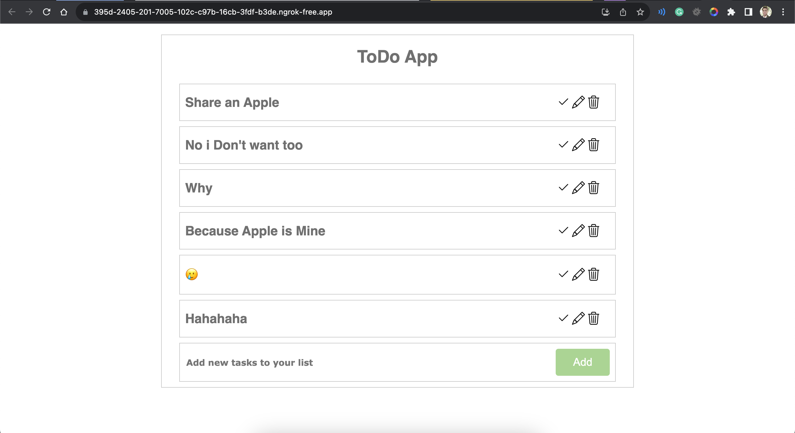
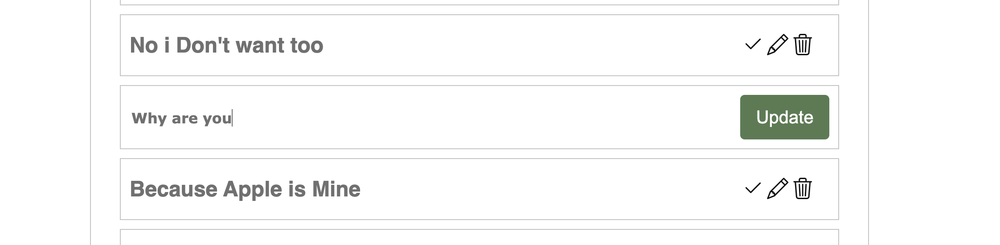
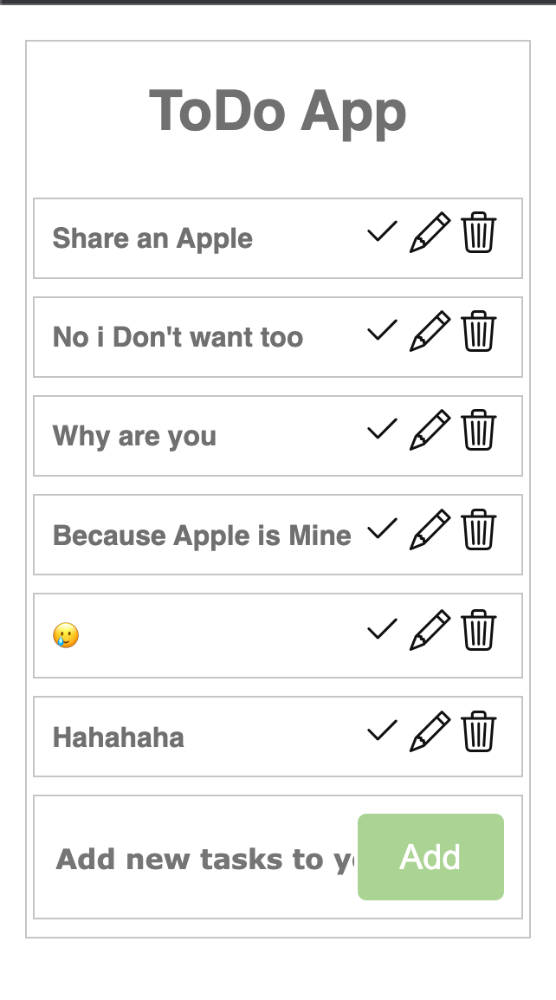
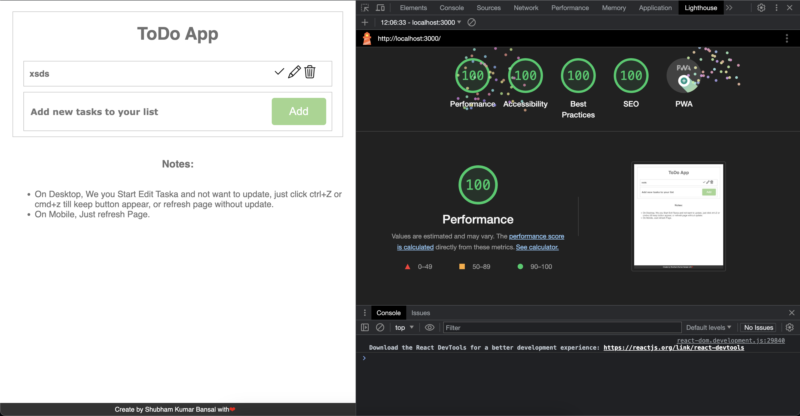

# ToDo Application in React

## Table of Contents

* <a href="#overview">Overview</a>
* <a href="#explanation">Explanation</a>
  * <a href="#indexhtml">index.html</a>
  * <a href="#indexjs">index.js</a>
  * <a href="#appjs">App.js</a>
  * <a href="#formtodojs">FormToDo.js</a>
  * <a href="#wraptodojs">WrapToDo.js</a>
  * <a href="#edittodojs">EditToDo.js</a>
  * <a href="#appcss-formtodocss-wraptodocss">App.css, FormToDo.css, WrapToDo.css</a>
* <a href="#screenshots">Screenshots</a>
  * <a href="#for-desktop">For Desktop</a>
  * <a href="#for-mobile">For Mobile</a>
* <a href="#working">Working</a>
* <a href="#features">Features</a>
* <a href="#usage">Usage</a>
* <a href="#installation">Installation</a>
  * <a href="#files-arrangement">Files Arrangement</a>
  * <a href="#function-calling-and-workflow">Function Calling and Workflow</a>
* <a href="#dependencies">Dependencies</a>
  * <a href="#bootstrap-icons">Bootstrap Icons</a>
  * <a href="#uuid">uuid</a>
* <a href="#technologies-used">Technologies Used</a>

**Overview:**

The "ToDo Application in React" is a web application built using React that allows users to manage their to-do lists. It provides features for adding, editing, deleting, and marking tasks as completed.

**Explanation:**

- `index.html`: This file is the main HTML file for the React application. It defines the structure of the web page and includes metadata and links to other resources.

- `index.js`: This JavaScript file imports React, ReactDOM, and the App component, rendering the application's root component to the DOM.

- `App.js`: The `App` component is the heart of the application. It manages the state of tasks, provides functions for adding, editing, deleting, and toggling tasks, and handles the local storage of task data.

- `FormToDo.js`: This component is responsible for rendering and handling the form to add new tasks to the list.

- `WarpToDo.js`: The `WrapToDo` component renders an individual task item and provides options to mark the task as completed, edit, or delete it.

- `EditToDo.js`: This component allows users to edit existing tasks.

- `App.css`, `FormToDo.css`, `WrapToDo.css`: These CSS files define the styles for various parts of the application, such as forms, lists, and individual task items.

### **Screenshots:**

**For Desktop:**





**For Mobile:**



**Performance:**



**Working:**

The "ToDo Application in React" allows users to efficiently manage their tasks. It stores task data locally, enabling users to access their to-do lists even after refreshing the page. The application provides an intuitive interface for adding, editing, and organizing tasks.

**Features:**

- Add new tasks to your to-do list.
- Edit existing tasks to update their names.
- Mark tasks as completed.
- Delete tasks from your list.
- Automatic local storage of tasks for persistence.

**Usage:**

To use the "ToDo Application in React," follow these steps:

1. Clone the repository to your local machine.
2. Install the necessary dependencies using npm or yarn.
3. Run the application locally using `npm start` or `yarn start`.

**Installation:**

To install the application and its dependencies, follow these steps:

1. Clone the repository to your local machine:

   ```bash
   git clone git@github.com:shubham07kb/react-todo.git
   ```

2. Install the necessary dependencies using npm or yarn.

   ```bash
   npm i
   ```
   
3. Run the application locally using `npm start` or `yarn start`.

   ```bash
   npm start
   ```
**Files Arrangement:**

- myapp/public/index.html: Main HTML file.
- myapp/src/index.js: Entry point of the React application.
- myapp/src/App.js: Main application component.
- myapp/src/components/FormToDo.js: Component for adding tasks.
- myapp/src/components/WarpToDo.js: Component for rendering individual tasks.
- myapp/src/components/EditToDo.js: Component for editing tasks.
- myapp/src/assets/App.css: Styles for the main application.
- myapp/src/assets/FormToDo.css: Styles for the task addition form.
- myapp/src/assets/WrapToDo.css: Styles for task items.

**Function Calling and Workflow:**

The application workflow involves adding, editing, and managing tasks:

- Users can add new tasks using the "Add" button in the form.
- Tasks are displayed in the list, and users can mark them as completed, edit them, or delete them using the icons.
- Editing a task opens an input field to modify the task name.
- Completed tasks are displayed with a strikethrough.

**Dependencies:**

- [Bootstrap Icons](https://icons.getbootstrap.com/): Bootstrap Icons are used for action icons like marking tasks as completed, editing tasks, and deleting tasks.

- [uuid](https://www.npmjs.com/package/uuid): The `uuid` library is used to generate unique identifiers (UUIDs) for tasks, ensuring each task has a unique ID.

**Technologies Used:**

- [React](https://reactjs.org/): JavaScript library for building user interfaces.
- [Bootstrap](https://getbootstrap.com/): Front-end framework for responsive design.
- [Bootstrap Icons](https://icons.getbootstrap.com/): Icons for UI elements.
- [uuid](https://www.npmjs.com/package/uuid): Library for generating unique identifiers.
